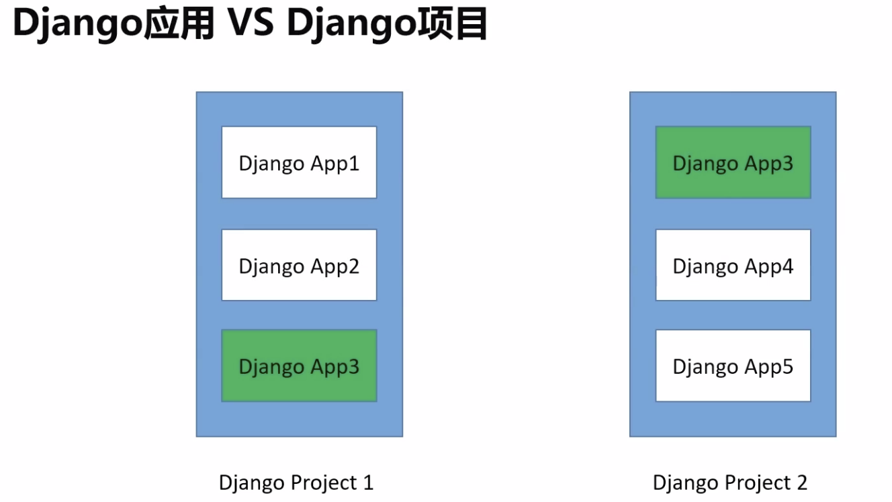
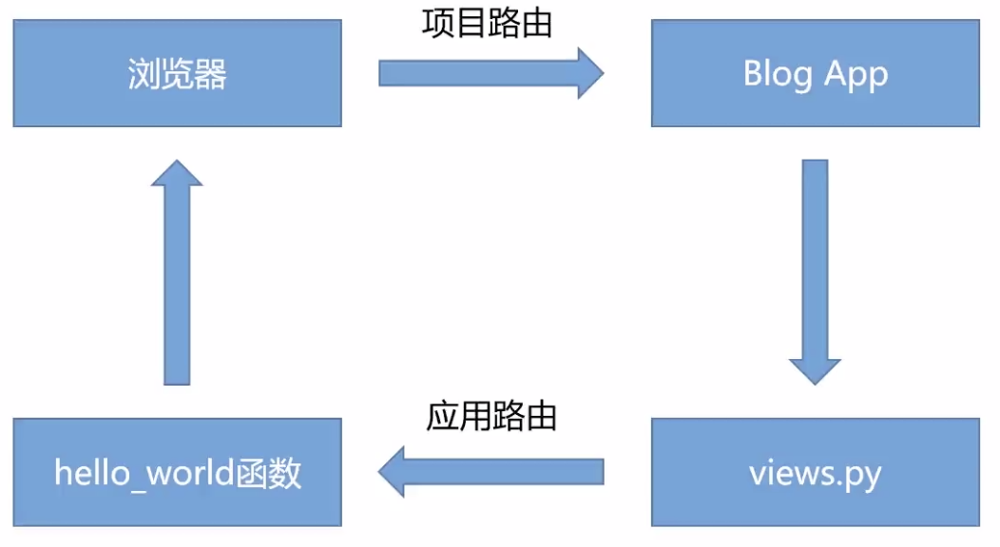
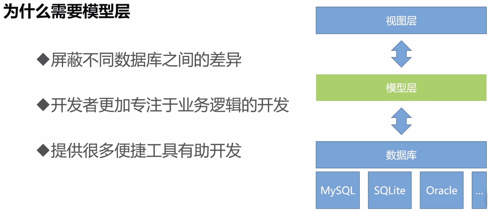
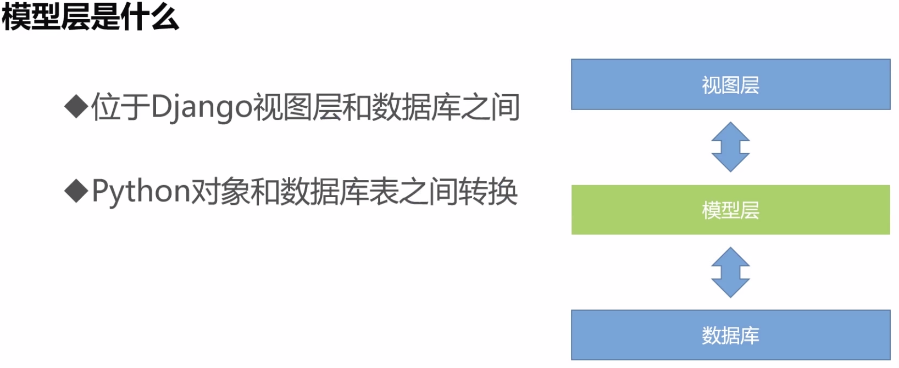

##  Django

### 安装

1. Python 3.7 +
2. Django 2.0
3. pycharm
4. Anaconda3 --python 的科学计算包 省去安装包的麻烦

```shell
export PATH=~/anaconda3/bin:$PATH
```

> 解决安装后 conda 无效，添加环境变量

---

### 初识Django项目

- 基本命令

```python
django-admin # 列出django命令

		check # 检查项目完整性
    compilemessages
    createcachetable
    dbshell
    diffsettings
    dumpdata # 把数据库数据导出到文件
    flush
    inspectdb
    loaddata # 把文件数据倒入到数据库
    makemessages
    makemigrations # 创建模型变更的迁移文件
    migrate # 执行上一个命令创建的迁移文件
    runserver # 本地简易运行项目
    sendtestemail
    shell # 进入Django 项目的 python shell 环境
    showmigrations
    sqlflush
    sqlmigrate
    sqlsequencereset
    squashmigrations
    startapp # 创建一个django 应用
    startproject # 创建一个django 项目
    test # 执行django 用例测试
    testserver
```


- 项目基本目录介绍

```shell
manage.py 项目管理文件
settings.py # 项目配置文件
urls.py     # django 路由文件
wsgi.py	# 应用文件内容
```

`python3 manage.py runserver`  —— open http://127.0.0.1:8000/





- 初始django应用

`python3 manage.py startapp blog`

```shell
apps.py	# 声明应用的地方
models.py # 定义模型的地方
views.py # 处理视图的地方
admin.py # 定义admin 莫克管理对象的地方
migrations
tests.py # 编写测试用例的地方
urls.py # （自行创建）管理应用路由的地方
```


`python3 manage.py migrate `

>  它可以让我们在修改Model后可以在不影响现有数据的前提下重建表结构。

- Hello_wold 实例

1. 在创建的`blog`应用中 `views.py` 中定义视图 例如

```python
from django.shortcuts import render

# Create your views here.
from django.http import HttpResponse


def hello_wold(resquest):
    return HttpResponse('你好啊 python ! ')


def test(resquest):
    return HttpResponse('<h1>测试 带标签带文件～</h1>')
```

这里编写了2个函数 返回内容 并且用HttpResponse包装

2. 然后配置应用的路由

自建 `urls.py` 

```python
#  配置应用层的路由
from django.urls import path, include
#  引入定义的视图文件
import blog.views

urlpatterns = [
    path('hello_wold', blog.views.hello_wold),
    path('test', blog.views.test),
]

```


3. 在项目路由中引入应用路由 用include 包装

```python
"""django_intriduction URL Configuration

The `urlpatterns` list routes URLs to views. For more information please see:
    https://docs.djangoproject.com/en/2.0/topics/http/urls/
Examples:
Function views
    1. Add an import:  from my_app import views
    2. Add a URL to urlpatterns:  path('', views.home, name='home')
Class-based views
    1. Add an import:  from other_app.views import Home
    2. Add a URL to urlpatterns:  path('', Home.as_view(), name='home')
Including another URLconf
    1. Import the include() function: from django.urls import include, path
    2. Add a URL to urlpatterns:  path('blog/', include('blog.urls'))
"""
from django.contrib import admin
from django.urls import path, include

urlpatterns = [
    path('admin/', admin.site.urls),
    path('blog/', include('blog.urls')),
]

```

4. 在项目settings.py 中添加应用

   ```python
   ...
   
   # Application definition
   
   INSTALLED_APPS = [
       'django.contrib.admin',
       'django.contrib.auth',
       'django.contrib.contenttypes',
       'django.contrib.sessions',
       'django.contrib.messages',
       'django.contrib.staticfiles',
       # myapp
       'blog.apps.BlogConfig'
   ]
   
   ...
   ```

   

---


### 模型层







- settings.py

```python
# Database 模型层配置
# https://docs.djangoproject.com/en/2.0/ref/settings/#databases

DATABASES = {
    'default': {
        'ENGINE': 'django.db.backends.sqlite3',  # 使用的数据库驱动
        'NAME': os.path.join(BASE_DIR, 'db.sqlite3'),  # 数据库名字对应文件名
    }
}
```


#### 创建blog文章模型


<details>
  <summary>字符串类型</summary>
  文章标题 <br>
  文章摘要 <br>
  文章内容 <br>
</details>

- 唯一id标记：int数字类型（自增 主键）
- 发布日期：日前类型


##### 模型字段定义

```stylus
数字类型：IntegeField
文本类型：TextField
日期类型：DateField
自增定义：AutoField
主键定义：primar_key
```

- 创建模型变更的迁移文件

> 格式 : python manage.py makemigrations <app name>

`python3 manage.py makemigrations blog`

- 执行上一个命令的 迁移文件

`python3 manage.py migrate`


### Django Shell

`python3 manage.py shell` 进入环境

> 通过Django Shell新建一篇文章

```shell
>>> from blog.moudels import Article
Traceback (most recent call last):
  File "<console>", line 1, in <module>
ModuleNotFoundError: No module named 'blog.moudels'
>>> from blog.models import Article
>>> a = Article()
>>> a.title = 'test django shell'
>>> a.brief_content = 'test django content'
>>> a.brief_content = 'test django ...............'
>>> a.brief_content = 'test django content'
>>> a.content = 'test django ...............'
>>> print(a)
Article object (None)
>>> a.save()
>>>
>>>
>>> aaa = Article.objects.all()
>>> at = aaa[0]
>>> print(at.title)
test django shell
```


### Django Admin 模块

- 创建一个超级管理员

`python3 manage.py createsuperuser`


### Django 模版系统

##### models.py 定义模型 数据库语法

```
class Article(models.Model):
    # 唯一id标记
    article_id = models.AutoField(primary_key=True)
    # 文章标题
    title = models.TextField()
    # 文章摘要
    brief_content = models.TextField()
    # 文章内容
    content = models.TextField()
    # 发布日期
    publish_date = models.DateTimeField(auto_now=True)

    # 返回文章的title作为admin标题
    def __str__(self):
        return self.title
```


##### 和大多数web框架模版语法差不多

```html



	<div>xxx</div>



	<p>xxx 1</p>

	<p>xxx 2</p>

```


##### 路由传参语法

```python
# 路由传参语法
urlpatterns = [
    path('hello_wold', blog.views.hello_wold),
    path('test', blog.views.test),
    path('content', blog.views.article_content),
    path('index', blog.views.get_index_page),
    path('detail/<int:article_id>', blog.views.detail_index_page),
]
```

##### 视图语法

```python

# 文章详情
def detail_index_page(request, article_id):
    all_article = Article.objects.all()
    curr_article = None
    for at in all_article:
        if at.article_id == article_id:
            curr_article = at
            break

    content_list = curr_article.content.split('\n')

    return render(request,
                  'blog/detail.html',
                  {
                      'detail_article': curr_article,
                      'content_list': content_list
                  }
                  )

```


